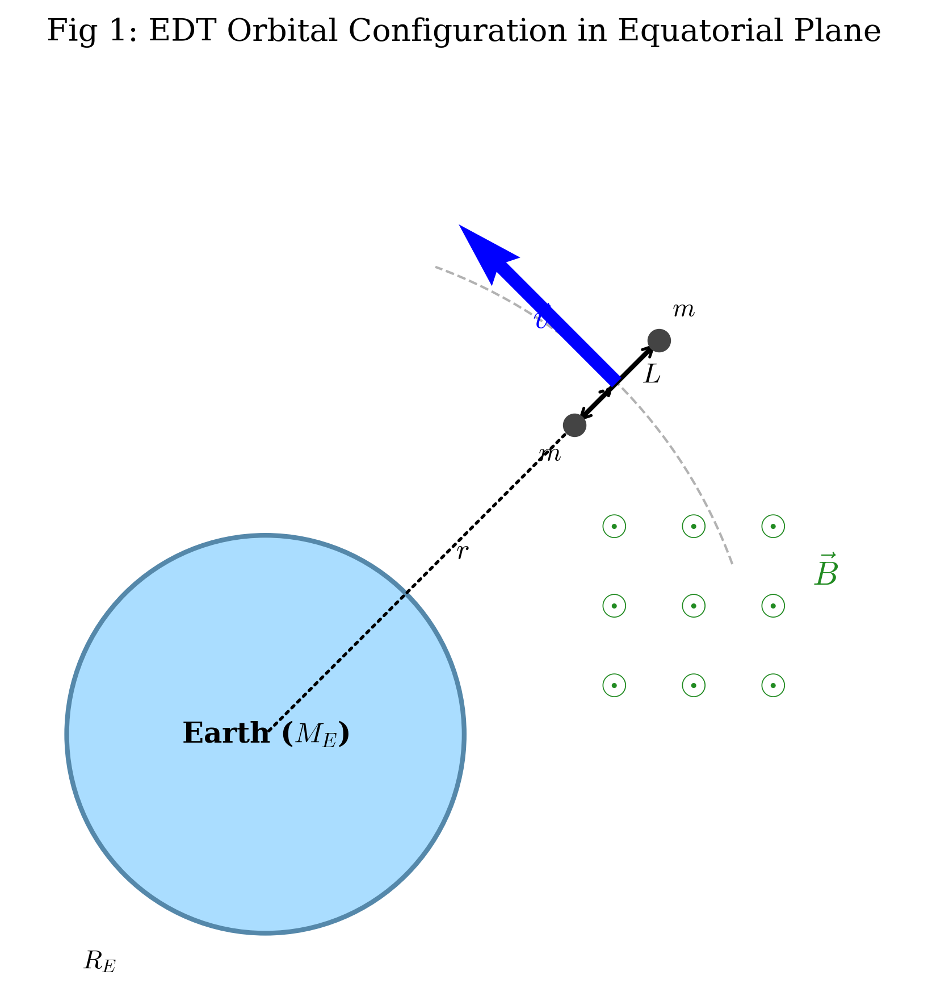

# Question
# Orbital Decay and Electro-Thermal Equilibrium of an Electrodynamic Tether

### Introduction
Electrodynamic tethers (EDTs) are long conducting wires used to exchange energy and momentum with a planetary magnetic field. In this problem, we consider an EDT system consisting of two identical small satellites, each of mass $m$, connected by a thin, straight, conductive tether of length $L$ and total resistance $R$. The system orbits the Earth in the equatorial plane at an altitude within the ionosphere. Due to the gravity-gradient effect, the tether is stabilized in a radial orientation, along the line connecting the system's center of mass and the Earth's center.

Throughout the problem, assume that the orbit is prograde and define the orbital velocity direction as $+\hat{\phi}$. The Earth's magnetic field in the equatorial plane is taken to point out of the orbital plane, in the $+\hat{z}$ direction. With this convention, $\vec{v}\times\vec{B}$ points radially outward.

**Useful Information:**
*   The Earth’s magnetic field can be modeled as a magnetic dipole. In the equatorial plane, the magnetic field is perpendicular to the orbital plane.
*   The magnitude of the magnetic field at a distance $r$ from the Earth's center is given by:
    $$B(r) = B_0 \left( \frac{R_E}{r} \right)^3$$
    where $R_E$ is the Earth's radius and $B_0$ is the magnetic field strength at the surface on the equator.
*   The mechanical energy of a circular orbit with radius $r$ for a total mass $M_{tot}$ is $E = -\frac{G M_E M_{tot}}{2r}$.
*   For any $x \ll 1$, the approximation $(1+x)^n \approx 1 + nx$ may be used.
*   The effective emission area of the cathode is $S_{emit} = \eta S$, where $S$ is the total surface area of the tether and $\eta$ is a dimensionless factor.


---

### Part A: Orbital Dynamics and Motional EMF (3.0 points)

Consider the tether system initially moving in a stable circular orbit of radius $r$ with $r \gg L$ in the Earth’s equatorial plane. The mass of the tether is negligible, so take $m_{tether}=0$. Therefore, the two satellites are the only significant masses in the system. The center of mass of the system moves at the Keplerian velocity $v$.

**A.1.** Using a rotating reference frame centered on the system's center of mass, find the expression for the tension $T_N$ at the midpoint of the tether. Use a first-order Taylor expansion in $L/r$ to simplify your result. **[1.2 pt]**

**A.2.** As the conductive tether cuts through the Earth's magnetic field lines, a motional electromotive force (EMF) is generated between its ends. Calculate the magnitude of this EMF, $\mathcal{E}$, as a function of $r$, $L$, and the given planetary constants. **[1.0 pt]**

**A.3.** Using the direction convention stated in the introduction, determine the polarity of the induced EMF. Which satellite, the one closer to Earth or the one farther from Earth, accumulates positive charges? **[0.8 pt]**

---

### Part B: Electrodynamic Drag and Orbital Evolution (4.0 points)

The tether is immersed in the ionospheric plasma, which is a dilute ionized gas. By using specialized contactors at the ends of the tether, for example a hollow cathode at the lower end and an electron-collection contactor at the upper end, the circuit is closed through the ambient plasma. The plasma acts as a return path with negligible resistance. Inside the tether, a steady conventional current $I$ flows from the inner satellite to the outer satellite, i.e. in the radially outward direction.


**B.1.** Derive the expression for the total Lorentz force $\vec{F}_L$ acting on the tether. Show that this force acts in the direction exactly opposite to the orbital velocity vector $\vec{v}$. **[1.0 pt]**

**B.2.** Due to the work done by the Lorentz force, the system's mechanical energy decreases, causing the orbit to decay. Assuming the orbit remains quasi-circular at all times, derive the differential equation for the rate of change of the orbital radius, $dr/dt$, in terms of $I$, $B(r)$, $L$, $m$, $M_E$, and $r$. You may then substitute the given expression for $B(r)$. **[1.5 pt]**

**B.3.** Let $Q$ be the total charge transferred through the tether as the system descends from an initial radius $r_1$ to a final radius $r_2$, where $r_1>r_2$. Prove that
$$
Q = \int I\,dt
$$
is independent of the tether resistance $R$ and independent of the detailed time evolution of the current $I(t)$. Find $Q$ in terms of $r_1$, $r_2$, the satellite mass $m$, the tether length $L$, and the planetary constants $M_E$, $R_E$, and $B_0$. **[1.5 pt]**

---

### Part C: Electro-Thermal Limits and Asymptotic Evolution (3.0 points)

In a realistic scenario, the current $I$ is limited by the ability of the tether's ends to exchange electrons with the ambient plasma. At the cathode, which is the negative end, the current is governed by Richardson's thermionic emission law. Furthermore, the tether is subject to strong Joule heating.

**Useful Information for Part C:**
*   Stefan-Boltzmann Law: The power radiated by a surface area $S$ with emissivity $\epsilon$ at temperature $T$ is $P_{rad} = \epsilon \sigma S T^4$, where $\sigma$ is the Stefan-Boltzmann constant.
*   Richardson’s Law for thermionic emission: The saturation current $I$ emitted by a surface $S_{emit}$ at temperature $T$ is given by $I = S_{emit} A_R T^2 \exp\left(-\frac{\Phi}{k_B T}\right)$, where $A_R$ is Richardson's constant and $\Phi$ is the work function.
*   Here $e$ denotes the elementary charge.

**C.1.** The tether reaches a steady-state temperature $T_{eq}$ when the Joule heating power is balanced by thermal radiation into space and the energy carried away by emitted electrons. Assume each emitted electron carries away an energy approximately equal to the work function $\Phi$, while its kinetic energy is negligible compared with $\Phi$. Also assume that the induced EMF $\mathcal{E}$ is sufficiently large that the current is limited by thermionic emission rather than by the Ohmic driving voltage. In other words, the consistency condition
$$
\mathcal{E} \ge I_{sat}R
$$
is satisfied. Formulate a system of two self-consistent equations that determine the steady-state temperature $T_{eq}$ and the saturated current $I_{sat}$. **[1.2 pt]**

**C.2.** Now consider the limiting case in which the tether is operated at the tipping point between thermionic-emission limitation and Ohmic limitation. At this point, the maximum thermionic emission current is exactly equal to the current driven by the available motional EMF:
$$
I_{sat}=\frac{\mathcal{E}(r)}{R}.
$$
Using the local motional EMF
$$
\mathcal{E}(r)=B(r)Lv
$$
and the orbital decay equation derived in Part B, find the expression for the orbital decay rate $|dr/dt|$ in this limiting regime. Show explicitly that the final expression is independent of the thermal parameters $S$, $\eta$, $\epsilon$, $A_R$, and $\Phi$. Express your answer in terms of $B$, $L$, $r$, $m$, and $R$. **[1.8 pt]**

# Answer
### Part A
**[A.1's Standard Solution]**
- **[Physical Principles]**: In a rotating frame centered at the center of mass, whose orbital radius is $r$, the angular velocity is
  $$
  \omega = \sqrt{\frac{G M_E}{r^3}}.
  $$
  For a satellite of mass $m$ at a radial displacement $x$ from the center of mass, the effective radial force is the sum of the centrifugal force and the gravitational force.
- **[Equations]**:
  $$
  F_{eff}=m\omega^2(r+x)-\frac{G M_E m}{(r+x)^2}. \quad (1)
  $$
- **[Derivation Steps]**:
  Using $x\ll r$ and $\omega^2=GM_E/r^3$,
  $$
  \begin{aligned}
  F_{eff}
  &\approx m\frac{G M_E}{r^3}(r+x)-\frac{G M_E m}{r^2}\left(1-\frac{2x}{r}\right) \\
  &=\frac{G M_E m}{r^2}\left(1+\frac{x}{r}-1+\frac{2x}{r}\right) \\
  &=\frac{3G M_E m x}{r^3}.
  \end{aligned}
  $$
  For the outer satellite, $x=L/2$. Since the tether is massless, the tension is uniform along the tether, so the midpoint tension equals the end tension.
- **[Final Result]**:
  $$
  T_N=\frac{3G M_E mL}{2r^3}.
  $$

**[A.2's Standard Solution]**
- **[Physical Principles]**: The motional EMF is produced by the effective electric field $\vec{v}\times\vec{B}$ along the tether.
- **[Equations]**:
  $$
  \mathcal{E}=\int_{r-L/2}^{r+L/2} v(r')B(r')\,dr'. \quad (2)
  $$
- **[Derivation Steps]**:
  The local orbital speed is $v(r')=\omega r'$, and
  $$
  B(r')=B_0\left(\frac{R_E}{r'}\right)^3.
  $$
  Therefore,
  $$
  \begin{aligned}
  \mathcal{E}
  &=\int_{r-L/2}^{r+L/2}\omega r'\frac{B_0R_E^3}{r'^3}\,dr' \\
  &=\omega B_0R_E^3\left[-\frac{1}{r'}\right]_{r-L/2}^{r+L/2} \\
  &\approx \frac{\omega B_0R_E^3L}{r^2}.
  \end{aligned}
  $$
  Using $\omega=\sqrt{G M_E/r^3}$ gives the final result.
- **[Final Result]**:
  $$
  \mathcal{E}=B_0R_E^3L\sqrt{\frac{G M_E}{r^7}}.
  $$

**[A.3's Standard Solution]**
- **[Physical Principles]**: The induced electric field is
  $$
  \vec{E}_{ind}=\vec{v}\times\vec{B}.
  $$
- **[Derivation Steps]**:
  Under the convention stated in the introduction, $\vec{v}$ points in the $+\hat{\phi}$ direction and $\vec{B}$ points in the $+\hat{z}$ direction. Hence $\vec{v}\times\vec{B}$ points radially outward, away from the Earth. Positive charges are therefore driven toward the outer end of the tether.
- **[Final Result]**:
  The satellite **farther from Earth** accumulates positive charges.

---

### Part B
**[B.1's Standard Solution]**
- **[Physical Principles]**: The Lorentz force on a current-carrying wire is
  $$
  d\vec{F}_L=I\,d\vec{l}\times\vec{B}.
  $$
- **[Derivation Steps]**:
  Inside the tether, the conventional current flows radially outward, so
  $$
  d\vec{l}=\hat r\,dr'.
  $$
  With $\vec{B}=B(r')\hat z$,
  $$
  \begin{aligned}
  \vec{F}_L
  &=\int_{r-L/2}^{r+L/2} I(\hat r\,dr')\times \left[B(r')\hat z\right] \\
  &=-\hat\phi\int_{r-L/2}^{r+L/2}I B(r')\,dr' \\
  &\approx -I B(r)L\,\hat\phi.
  \end{aligned}
  $$
  Since the orbital velocity points in the $+\hat\phi$ direction, the Lorentz force is opposite to the orbital velocity.
- **[Final Result]**:
  $$
  \vec{F}_L\approx -I B(r)L\,\hat v.
  $$

**[B.2's Standard Solution]**
- **[Equations]**:
  The total orbiting mass is $2m$, so the circular-orbit mechanical energy is
  $$
  E=-\frac{G M_E(2m)}{2r}=-\frac{G M_E m}{r}.
  $$
  The mechanical power delivered by the Lorentz force is
  $$
  P=\vec{F}_L\cdot\vec{v}=-I B(r)Lv.
  $$
- **[Derivation Steps]**:
  For a quasi-circular orbit,
  $$
  v=\sqrt{\frac{G M_E}{r}}.
  $$
  Since
  $$
  \frac{dE}{dt}=\frac{G M_E m}{r^2}\frac{dr}{dt},
  $$
  the energy balance gives
  $$
  \frac{G M_E m}{r^2}\frac{dr}{dt}=-I B(r)L\sqrt{\frac{G M_E}{r}}.
  $$
  Solving for $dr/dt$ gives
  $$
  \frac{dr}{dt}=-\frac{I B(r)L r^{3/2}}{m\sqrt{G M_E}}.
  $$
  Substituting $B(r)=B_0(R_E/r)^3$ gives the equivalent explicit form.
- **[Final Result]**:
  $$
  \frac{dr}{dt}=-\frac{I B_0R_E^3L}{m\sqrt{G M_E}\,r^{3/2}}.
  $$

**[B.3's Standard Solution]**
- **[Derivation Steps]**:
  The total transferred charge is
  $$
  Q=\int I\,dt.
  $$
  From B.2,
  $$
  dt=-\frac{m\sqrt{G M_E}}{I B(r)L r^{3/2}}\,dr.
  $$
  Hence
  $$
  I\,dt=-\frac{m\sqrt{G M_E}}{B(r)L r^{3/2}}\,dr.
  $$
  The current $I$ cancels, so $Q$ is independent of the detailed current history and of the resistance that determines that history. Since the system descends from $r_1$ to $r_2$ with $r_1>r_2$,
  $$
  \begin{aligned}
  Q
  &=\int_{r_2}^{r_1}\frac{m\sqrt{G M_E}}{B(r)Lr^{3/2}}\,dr \\
  &=\frac{m\sqrt{G M_E}}{B_0R_E^3L}\int_{r_2}^{r_1}r^{3/2}\,dr.
  \end{aligned}
  $$
- **[Final Result]**:
  $$
  Q=\frac{2m\sqrt{G M_E}}{5B_0R_E^3L}\left(r_1^{5/2}-r_2^{5/2}\right).
  $$

---

### Part C
**[C.1's Standard Solution]**
- **[Equations]**:
  Since the current is emission-limited, $I=I_{sat}$. The steady-state energy balance is
  $$
  I_{sat}^2R=\epsilon\sigma S T_{eq}^4+\frac{I_{sat}\Phi}{e}.
  $$
  The Richardson thermionic-emission constraint is
  $$
  I_{sat}=\eta S A_R T_{eq}^2\exp\left(-\frac{\Phi}{k_BT_{eq}}\right).
  $$
  These equations apply provided the EMF is large enough to drive the saturation current:
  $$
  \mathcal{E}\ge I_{sat}R.
  $$
- **[Final Result]**:
  The two self-consistent equations are
  $$
  I_{sat}^2R=\epsilon\sigma S T_{eq}^4+\frac{I_{sat}\Phi}{e},
  $$
  $$
  I_{sat}=\eta S A_R T_{eq}^2\exp\left(-\frac{\Phi}{k_BT_{eq}}\right),
  $$
  together with the consistency condition $\mathcal{E}\ge I_{sat}R$.

**[C.2's Standard Solution]**
- **[Derivation Steps]**:
  At the tipping point between thermionic-emission limitation and Ohmic limitation,
  $$
  I=I_{sat}=\frac{\mathcal{E}(r)}{R}.
  $$
  Using the local motional EMF $\mathcal{E}(r)=B(r)Lv$, we have
  $$
  I=\frac{B(r)Lv}{R}.
  $$
  From B.2, the magnitude of the orbital decay rate can be written as
  $$
  \left|\frac{dr}{dt}\right|=\frac{IB(r)Lr}{mv}.
  $$
  Substituting the tipping-point current gives
  $$
  \left|\frac{dr}{dt}\right|=\frac{(B L v/R)B L r}{mv}.
  $$
- **[Final Result]**:
  $$
  \left|\frac{dr}{dt}\right|=\frac{B^2L^2r}{mR}.
  $$
  The thermal parameters $S$, $\eta$, $\epsilon$, $A_R$, and $\Phi$ determine whether the tipping point can be reached, but once the current is fixed by $\mathcal{E}/R$, they do not appear in the final orbital decay rate.

# GradingRubric
### [IPHO-Style Marking Scheme]
**Total Score: 10.0 pts**

#### Part A: Orbital Dynamics and Motional EMF (Total: 3.0 pts)

| Sub-part | Item / Key Equation | Marks | Notes for Graders |
| :--- | :--- | :--- | :--- |
| **A.1** | **Effective force equation:** Setting up the net radial force in the rotating frame: $F_{eff}=m\omega^2(r+x)-\frac{GM_E m}{(r+x)^2}$. | 0.3 | Accept equivalent tidal-force formulations. |
| | **Taylor expansion:** Expanding to first order and obtaining $F_{eff}=\frac{3GM_E m x}{r^3}$. | 0.4 | Award partial credit for using $\omega^2=GM_E/r^3$ correctly. |
| | **Force balance:** Recognizing that a massless tether has uniform tension and substituting $x=L/2$. | 0.3 | |
| | **Final result:** $T_N=\frac{3GM_E mL}{2r^3}$. | 0.2 | Must have dimensions of force. |
| **A.2** | **Motional EMF setup:** Writing $\mathcal{E}=\int v(r')B(r')\,dr'$ or using $\mathcal{E}\approx vB L$ at the center of mass. | 0.3 | Both approaches are acceptable because $L\ll r$. |
| | **Substitution:** Using $v=\omega r$ and $B=B_0(R_E/r)^3$. | 0.3 | |
| | **Keplerian relation:** Using $\omega=\sqrt{GM_E/r^3}$. | 0.2 | |
| | **Final result:** $\mathcal{E}=B_0R_E^3L\sqrt{\frac{GM_E}{r^7}}$. | 0.2 | |
| **A.3** | **Directional logic:** Applying $\vec{E}_{ind}=\vec{v}\times\vec{B}$ under the stated sign convention. | 0.4 | Must conclude that $\vec{v}\times\vec{B}$ points radially outward. |
| | **Conclusion:** The satellite farther from Earth accumulates positive charges. | 0.4 | No justification earns no credit for this sub-part. |
| **Subtotal** | **Part A Total** | **3.0** | |

---

#### Part B: Electrodynamic Drag and Orbital Evolution (Total: 4.0 pts)

| Sub-part | Item / Key Equation | Marks | Notes for Graders |
| :--- | :--- | :--- | :--- |
| **B.1** | **Lorentz force primitive:** $d\vec{F}_L=I\,d\vec{l}\times\vec{B}$. | 0.3 | Accept macroscopic form $\vec{F}_L=I\vec{L}\times\vec{B}$. |
| | **Current direction and cross product:** Identifying $d\vec{l}=\hat r\,dr$ and $\hat r\times\hat z=-\hat\phi$. | 0.3 | |
| | **Magnitude and direction:** $F_L\approx I B(r)L$ and $\vec{F}_L$ points opposite to $\vec{v}$. | 0.4 | 0.2 for magnitude, 0.2 for direction. |
| **B.2** | **Total orbital energy:** $E=-\frac{GM_E(2m)}{2r}=-\frac{GM_E m}{r}$. | 0.4 | Deduct if the factor of two in the total mass is missed. |
| | **Power relation:** $dE/dt=\vec{F}_L\cdot\vec{v}=-I B L v$. | 0.4 | Must include the negative sign. |
| | **Chain rule:** $dE/dt=\frac{GM_E m}{r^2}\frac{dr}{dt}$. | 0.4 | |
| | **Final result:** $\frac{dr}{dt}=-\frac{I B_0R_E^3L}{m\sqrt{GM_E}\,r^{3/2}}$. | 0.3 | Equivalent form with $B(r)$ retained is acceptable. |
| **B.3** | **Integral setup:** $Q=\int I\,dt$. | 0.3 | |
| | **Variable substitution:** Using B.2 to obtain $I\,dt=-\frac{m\sqrt{GM_E}}{B(r)Lr^{3/2}}\,dr$. | 0.5 | Must explicitly show that $I$ cancels. |
| | **Independence statement:** Correctly explaining that $Q$ is independent of $R$ and $I(t)$, while still depending on $m$, $L$, and planetary constants. | 0.3 | |
| | **Integration:** Correctly integrating $\int r^{3/2}\,dr=\frac{2}{5}r^{5/2}$. | 0.3 | Limits must give a positive $Q$ for $r_1>r_2$. |
| | **Final result:** $Q=\frac{2m\sqrt{GM_E}}{5B_0R_E^3L}(r_1^{5/2}-r_2^{5/2})$. | 0.4 | |
| **Subtotal** | **Part B Total** | **4.0** | |

---

#### Part C: Electro-Thermal Limits and Asymptotic Evolution (Total: 3.0 pts)

| Sub-part | Item / Key Equation | Marks | Notes for Graders |
| :--- | :--- | :--- | :--- |
| **C.1** | **Joule heating and radiation:** Identifying $P_{in}=I_{sat}^2R$ and $P_{rad}=\epsilon\sigma S T_{eq}^4$. | 0.4 | 0.2 pts for each term. |
| | **Emission cooling:** Identifying $P_{emit}=I_{sat}\Phi/e$. | 0.2 | |
| | **Energy balance:** Writing $I_{sat}^2R=\epsilon\sigma S T_{eq}^4+I_{sat}\Phi/e$. | 0.3 | |
| | **Richardson law:** Writing $I_{sat}=\eta S A_R T_{eq}^2\exp[-\Phi/(k_BT_{eq})]$. | 0.3 | |
| | **EMF consistency:** Stating $\mathcal{E}\ge I_{sat}R$. | 0.2 | |
| **C.2** | **Tipping-point condition:** Recognizing $I_{sat}=\mathcal{E}(r)/R$. | 0.4 | |
| | **Local EMF:** Using $\mathcal{E}(r)=B(r)Lv$. | 0.4 | |
| | **Substitution into decay rate:** Substituting $I=B L v/R$ into $|dr/dt|=IBLr/(mv)$. | 0.5 | |
| | **Final result and interpretation:** Obtaining $|dr/dt|=B^2L^2r/(mR)$ and noting independence from $S$, $\eta$, $\epsilon$, $A_R$, and $\Phi$ in this limiting regime. | 0.5 | |
| **Subtotal** | **Part C Total** | **3.0** | |

---

### [Grading Notes & Pitfalls]

1. **Allowed alternative solutions**:
   - In **A.2**, evaluating the motional EMF at the center of mass as $\mathcal{E}\approx v_{cm}B_{cm}L$ is equivalent to the integral method to first order in $L/r$.
   - In **B.2**, students may use angular momentum instead of energy. With $L_{ang}=2mvr=2m\sqrt{GM_Er}$ and torque $\tau=-IBLr$, the same $dr/dt$ follows.

2. **Common mistakes and deductions**:
   - In **B.2**, forgetting that the total orbiting mass is $2m$ changes the energy by a factor of two.
   - In **B.1**, reversing the current direction reverses the Lorentz force. The current direction inside the tether is radially outward under the convention used in this problem.
   - In **B.3**, if $I$ does not cancel, the proof of path independence has failed.
   - In **C.2**, the thermal parameters determine the accessibility of the tipping point but do not appear in the final orbital-decay expression once $I=\mathcal{E}/R$ is imposed.



# DiagramCode
### [1] Visual Strategy Plan

**Total number of charts to generate: 2**

**Figure 1: Orbital Configuration and Electrodynamic Induction**
- **Insertion Location**: After the introductory section, immediately before **Part A**.
- **Drawing Content and Colors**:
  - Earth, circular orbit, radially oriented tether, two satellites, center-of-mass radius $r$, tether length $L$, orbital velocity $\vec{v}$, and magnetic field $\vec{B}$ pointing out of the orbital plane.

**Figure 2: Electrodynamic Forces and Plasma Circuit Model**
- **Insertion Location**: After the transitional text of **Part B**, before sub-question **B.1**.
- **Drawing Content and Colors**:
  - Local tether view with current $I$ flowing radially outward, magnetic field $\vec{B}$ out of the page, Lorentz force $\vec{F}_L$ opposite to $\vec{v}$, plasma return path, and thermal radiation arrows.

---

### [2] Integrated Python Script

```python
import os
import matplotlib.pyplot as plt
import matplotlib.patches as patches
import numpy as np

os.makedirs("image", exist_ok=True)

# Use Matplotlib native MathText rendering to avoid external LaTeX dependency errors.
plt.rcParams.update({
    "text.usetex": False,
    "mathtext.fontset": "cm",
    "font.family": "serif",
    "font.size": 11
})


def generate_figure_1():
    """Draw Figure 1: orbital configuration and motional EMF."""
    fig, ax = plt.subplots(figsize=(7, 6))
    ax.set_aspect("equal")
    ax.axis("off")

    earth_radius = 2.0
    earth = patches.Circle((0, 0), earth_radius, color="#AADDFF", ec="#5588AA", lw=2)
    ax.add_patch(earth)
    ax.text(0, 0, r"Earth ($M_E$)", ha="center", va="center", fontsize=12, fontweight="bold")

    orbit_r = 5.0
    orbit_arc = patches.Arc((0, 0), 2 * orbit_r, 2 * orbit_r,
                            theta1=20, theta2=70, ls="--", color="gray", alpha=0.6)
    ax.add_patch(orbit_arc)

    angle = np.deg2rad(45)
    half_L = 0.6
    r_inner = orbit_r - half_L
    r_outer = orbit_r + half_L
    x1, y1 = r_inner * np.cos(angle), r_inner * np.sin(angle)
    x2, y2 = r_outer * np.cos(angle), r_outer * np.sin(angle)
    cm_x, cm_y = orbit_r * np.cos(angle), orbit_r * np.sin(angle)

    # Tether and satellites
    ax.plot([x1, x2], [y1, y2], color="black", lw=2, zorder=3)
    ax.scatter([x1, x2], [y1, y2], color="#444444", s=80, zorder=4)
    ax.text(x1 - 0.25, y1 - 0.35, r"$m$", ha="center")
    ax.text(x2 + 0.25, y2 + 0.25, r"$m$", ha="center")

    # Tether length
    ax.annotate("", xy=(x2, y2), xytext=(x1, y1),
                arrowprops=dict(arrowstyle="<->", color="black", lw=1.2))
    ax.text((x1 + x2) / 2 + 0.25, (y1 + y2) / 2, r"$L$", fontsize=12)

    # Radius to center of mass
    ax.annotate("", xy=(cm_x, cm_y), xytext=(0, 0),
                arrowprops=dict(arrowstyle="->", color="black", linestyle=":", lw=1.3))
    ax.text(cm_x / 2 + 0.15, cm_y / 2, r"$r$", fontsize=12)

    # Velocity vector in +phi direction
    v_dir = np.array([-np.sin(angle), np.cos(angle)])
    ax.quiver(cm_x, cm_y, v_dir[0], v_dir[1], color="blue", scale=4,
              width=0.015, zorder=5)
    ax.text(cm_x - 0.85, cm_y + 0.55, r"$\vec{v}$", color="blue", fontsize=14)

    # Magnetic field out of the page
    for i in range(3):
        for j in range(3):
            bx, by = 3.5 + i * 0.8, 0.5 + j * 0.8
            ax.text(bx, by, r"$\odot$", color="forestgreen", fontsize=15,
                    ha="center", va="center")
    ax.text(5.5, 1.5, r"$\vec{B}$", color="forestgreen", fontsize=14)

    ax.text(-1.85, -2.35, r"$R_E$", fontsize=11)
    ax.set_xlim(-2.5, 6.5)
    ax.set_ylim(-2.5, 6.5)
    plt.title("Fig 1: EDT Orbital Configuration in Equatorial Plane", pad=20)
    plt.tight_layout()
    plt.savefig("image/ipho_2025_1_1.png", dpi=300, bbox_inches="tight")
    plt.close(fig)
    print("image/ipho_2025_1_1.png generated successfully.")


def generate_figure_2():
    """Draw Figure 2: electrodynamic force and plasma circuit model."""
    fig, ax = plt.subplots(figsize=(7, 5))
    ax.set_aspect("equal")
    ax.axis("off")

    # Tether: vertical direction is +r, i.e. radially outward.
    tether_y = np.linspace(-2, 2, 100)
    ax.plot(np.zeros_like(tether_y), tether_y, color="black", lw=3, zorder=3)

    # Satellites
    ax.scatter([0, 0], [-2, 2], color="#444444", s=150, zorder=4)
    ax.text(0.3, 2, "Outer Sat (Anode)", va="center")
    ax.text(0.3, -2, "Inner Sat (Cathode)", va="center")

    # Current: radially outward, from inner to outer satellite.
    ax.annotate("", xy=(0, 0.8), xytext=(0, -0.8),
                arrowprops=dict(arrowstyle="->", color="red", lw=2))
    ax.text(-0.45, 0, r"$I$", color="red", fontsize=14, fontweight="bold")

    # With B out of the page and I upward, I dl x B points to the right.
    # Therefore v is drawn to the left so that F_L is opposite to v.
    ax.quiver(0, 0, 1.5, 0, color="orangered", scale=5, width=0.02, zorder=5)
    ax.text(1.05, 0.3, r"$\vec{F}_L$", color="orangered", fontsize=14)

    ax.quiver(0, 0, -1.5, 0, color="blue", scale=5, width=0.012, alpha=0.6)
    ax.text(-1.25, 0.3, r"$\vec{v}$", color="blue", fontsize=14)

    # Plasma return path
    arc_theta = np.linspace(-np.pi / 2, np.pi / 2, 100)
    arc_x = 1.5 * np.cos(arc_theta)
    arc_y = 2.0 * np.sin(arc_theta)
    ax.plot(arc_x, arc_y, color="skyblue", ls="--", lw=2, alpha=0.7)
    ax.text(1.65, 0, "Ionospheric\nplasma path", color="skyblue", ha="left", fontsize=10)

    # Thermal radiation arrows
    for y_pos in [-1.2, 0, 1.2]:
        for direction in [-1, 1]:
            dx = 0.3 * direction
            ax.annotate("", xy=(dx * 2, y_pos + 0.2), xytext=(dx, y_pos),
                        arrowprops=dict(arrowstyle="->", connectionstyle="arc3,rad=.3",
                                        color="purple", alpha=0.6))
    ax.text(-1.2, -1.8, r"$P_{rad}\propto T^4$", color="purple", fontsize=10)

    ax.text(-1.55, 2.0, r"$\vec{B}=\odot$", color="forestgreen", fontsize=14)
    ax.text(-0.6, 2.35, r"$+\hat r$", fontsize=11)
    ax.text(-1.9, -0.35, r"$+\hat\phi$", color="blue", fontsize=11)

    ax.set_xlim(-2.2, 3.2)
    ax.set_ylim(-2.6, 2.7)
    plt.title("Fig 2: Electrodynamic Forces and Plasma Return Circuit", pad=20)
    plt.tight_layout()
    plt.savefig("image/ipho_2025_1_2.png", dpi=300, bbox_inches="tight")
    plt.close(fig)
    print("image/ipho_2025_1_2.png generated successfully.")


if __name__ == "__main__":
    generate_figure_1()
    generate_figure_2()
    print("All figures generated for IPhO Problem 1.")
```
